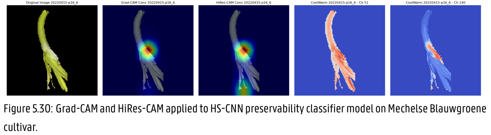

# Academic/Internship/Work Experiences 

Short high-level overview of projects I have worked on. Code available on request.
 
## Computer Vision / Machine Learning Engineer Intern | imec / ILVO / UGent 
🗓️ 25-09-2023 – 06-09-2024 
 
Thesis: **Explainable AI for VNIR/NIR Hyperspectral Imaging: Key Wavelengths for Leek Quality Prediction**   
UGent Library: <https://lib.ugent.be/en/catalog/rug01:003214821>
 
Main Objective: Determine Key Wavelengths in the Near Infrared spectrum for making predictions on Leek quality parameters such as dry weight or shelf-life/preservability. 
 
Using **explainable AI** frameworks like SHAP to determine which wavelengths of the near infrared hyperspectral camera were most important in determining certain quality parameters such as dry weight and shelf life. This allows for the usage of much cheaper multispectral camera’s (**cost reduction of 95%** from 65 thousand to 3 thousand euros) to make predictions with **nearly the same R² score and accuracy** (3% difference). 
 
During this project I strengthened my: 
- Skills in data preprocessing (**OpenCV**, **pandas**, **numpy**, **matplotlib**, **seaborn**, **spectral**, ...) 
- Experience with Python and AI frameworks like **PyTorch**, **scikit-learn**, ... 
- Understanding of classical machine learning algorithms like **SVR**, **PLSR**, **Random Forrest**, etc. 
- Understanding of deep learning models like **CNNs** and **autoencoders** 
- The emerging field of explainable AI (XAI) by using frameworks like **SHAP** and **Grad-CAM** 
- Experience with hyperparameter optimization frameworks like **Optuna**

Image taken from the Extended Abstract of this thesis.

Image taken from this thesis, Chapter 5. Using Grad-CAM and HiRes-CAM to understand which regions of the image are used by the CNN classifier model to make the prediction.

## Automated Tree Measurement and Mapping Computer Vision Project | UGent 
🗓️ 12-02-2024 – 16-06-2024 
 
Main Objective: Measure the width of all trees along the path of a vehicle with a dashcam and map them. 
 
Approach: 
- Calibrate RGB dashcam with Zhangs method. Then undistort the input video. This was done with **Python**, **OpenCV** and **numpy**.
- Segment trees on undistorted 2D RGB input frames. Here a pre-trained **R-CNN** model called PercepTreeV1 was used. This is made with the **detectron2** framework. 
- Create **sparse and dense point cloud** (3D representation) using COLMAP. Use the dense model to create **geometric depth maps** for each 2D input frame. This step uses SIFT keypoint detection and matching of keypoints throughout multiple frames in a process called **Structure from Motion (SfM)**. 
- Use segmented trees and corresponding depth map to determine tree width (Euclidean distance). 
- Use **Simultaneous Localization and Mapping** to create a map of detected trees. 
- Generate video where segmented trees and their estimated width are shown next to the map with all the tree positions and current camera position. 
 
Main challenges & Solutions: 
- Turning 2D images from an uncalibrated dashcam camera into a 3D model using Structure from Motion (SfM). 
- The same tree can occur in multiple frames. We don’t need to rely on Multiple Object Tracking as seen in frameworks like YOLO from the Ultralytics library. Instead **DBSCAN** can be used to cluster measurements thanks to the sparse point cloud that was generated by COLMAP. After clustering the measurements for each tree remove outliers and then take the median of the tree measurements of the same tree.

Image of the dense reconstruction with red rectangles representing input frames that were stitched together into a dense point cloud with COLMAP.

Single frame of the output video with segmented trees and their estimated with annotated, accompanied by a top down view of the trees and camera position.

## Hand Gesture Recognition Project | Sony / UGent 
🗓️ 02-10-2023 – 15-12-2023 
 
Main Objectives: 
- Use deep learning models to try and classify the correct hand gesture using a depth sensing camera (time of flight infrared) provided by Sony. 
 
Approach: 
- Convert depth images to 2D black and white images with a region of interest crop of the hand. 
- Perform a Train/Validation/Test split. 
- Feed as few frames as possible into the different model types using **3D CNN**, **LSTM** or **GRU** 
- Construct the model layers incrementally using **Python** and **Tensorflow**, try to keep the model architecture as simple as possible. 
- Use **Tensorboard** to verify if the layer makes the model better and not overly complex. 
- Fine tuning of hyperparameters. 
 
Main challenges & Solutions: 
- Determining if the classifier models can distinguish easily between the different classes of hand gestures. **Tensorboard** has tools that allow you to visualize how close the decision between two classes is and what the effect of each layer of the model is.

## Systems Design Project | UGent 
🗓️ 02-10-2023 – 15-12-2023 
 
Main Objectives: 
- Create a microservice architecture with multiple Docker microservices. Use SAGA transactions. 
 
Together with a team we designed and implemented a microservices-based hospital infrastructure, ensuring seamless communication between key services such as patient management, room reservations, personnel scheduling, and inventory tracking. By leveraging FastAPI and adhering to OpenAPI standards, I contributed to the development of a high-performance, asynchronous API ecosystem. My expertise in Saga Orchestration allowed for efficient transaction management across distributed services, ensuring that failures in one service would not compromise the entire workflow. A key contribution was the implementation of asynchronous processing for medical personnel and room reservations, utilizing retry mechanisms with exponential backoff to enhance system robustness. Additionally, I used Docker and containerized deployments to streamline system scalability and deployment efficiency. 

During this project, I strengthened my: 
- Expertise in microservices architecture, implementing onion-style architecture for maintainability and service independence. 
- Hands-on experience with **Python** framework **FastAPI** for API development. 
- Proficiency in database-per-microservice design, ensuring data consistency and isolation across hospital services. 
- In-depth understanding of distributed transaction management, utilizing **Saga Orchestration** and compensating transactions for failure recovery. 
- Implementation of **asynchronous and event-driven architectures**, optimizing hospital workflows such as personnel scheduling and inventory tracking. 
- Practical experience with containerization and deployment, leveraging **Docker** for scalable **microservices** deployment.

## Data Engineering Intern | Cegeka 
🗓️ 07-02-2022 – 10-06-2022 
 
Main Objectives: 
- Migrating **SQL Server Integration Services** (SSIS) **ETL** Pipelines from Traditional On-Premise **Data Warehouses** to a Cloud **Data Lakehouse** Platform with **Azure Synapse** Analytics, Azure Data Factory (ADF), Azure **Databricks**, and Delta Lake. 
- Customer service dashboards (in **PowerBI**) for monitoring SSIS and Azure data pipeline jobs. 
 
Designed and implemented a cloud-native Data Lakehouse architecture by migrating on-premise SQL Server Data Warehouse ETL pipelines from SQL Server Integration Services (SSIS) to Azure Data Factory (ADF) Mapping Data Flows (MDF), leveraging Azure Data Lake Storage (ADLS) Gen2, Delta Lake, and Azure Databricks for distributed data processing with Apache Spark. Optimized data ingestion, transformation, and orchestration using ADF pipelines, implemented ACID-compliant Delta Tables, and integrated role-based access control (RBAC) and data governance policies. 
 
Developed scalable ETL workflows with Databricks notebooks, enabling big data processing, schema evolution, and real-time analytics while reducing operational costs through serverless execution. Evaluated MDF’s enterprise readiness, performance tuning, and cost-efficiency compared to code-based ETL alternatives in Databricks, ensuring high-performance data pipelines, SQL-based querying,  and integration with Power BI.

## COVID Vaccination Data Engineering Project | HoGent 
🗓️ 04-10-2021 – 17-12-2021 
 
Main Objective: Use open and FAIR data to create an overview of possible correlations between COVID 
disease spread, vaccination grade, education level, urban density, forest cover, etc. 
Approach: 
- Use **open data** sources such as Sciensano, StatBel, Statistiek Vlaanderen, etc. 
- Design an appropriate **Data Warehouse** (DWH), we used **Microsoft SQL server**. 
- Use **python** and **sqlalchemy** to create **ETL/ELT** pipelines that fill the DWH 
- Automate the ELT pipelines so only new data is added from the open data sources to the DWH. This pipeline is then run automatically, 4 times a day, from a **Linux server**. 
- Create **PowerBI** reports that convey a clear message about the correlations with the gathered data. 
 
Main challenges & Solutions: 
- When loading the data from open data sources only the new data should be fetched. This was solved by using the correct API calls. 
- Visualizing graphs such as scatter plots over time. Custom visualizations with a playable time component were used in PowerBI. 
- Displaying the data on maps of Belgium with drill down functionality (e.g. province to city) required custom map data, tools and plugins.

Image of the presentation of the project at the CyberSecEurope Expo in Brussels, I am standing at the right side in this image, behind the laptop.

## Software Engineer | Volvo Cars 
🗓️ 21-06-2021 – 03-09-2021 (first summer)  
🗓️ 27-06-2022 – 02-09-2022 (second summer at Volvo Cars) 
 
Main Objective (first summer): 
- Creating a dynamically configurable visualization app for the car assembly lines of all Volvo Cars (and polestar) plants worldwide. 
 
I made dynamically configurable real time visualizations of the production lines of the final assembly. These are now used for all Volvo Cars and Polestar factories worldwide. The front-end was made with **Angular** and the back-end API’s were written with **Java** using **Spring Boot** and **WebFlux**. 
 
Main challenges & Solutions: 
- Updating elements on the page using **WebFlux server-sent-events** to minimize data load for real time tracking of each car in the visualization.

The image on the top left shows the drag and drop configuration screen (made on top of the gridster2-framework). When the configuration is saved, the real-time data of the cars on each assembly line will be shown, as seen on the image at the bottom right.
 
 
Main Objectives (second summer): 
 
- Visualization app for the bodybuffer, which is an essential part for the line-balancing during the final assembly of the cars. 
- Database migration for the nutrunners, while the production lines are running non-stop, in collaboration with Atlas Copco.

